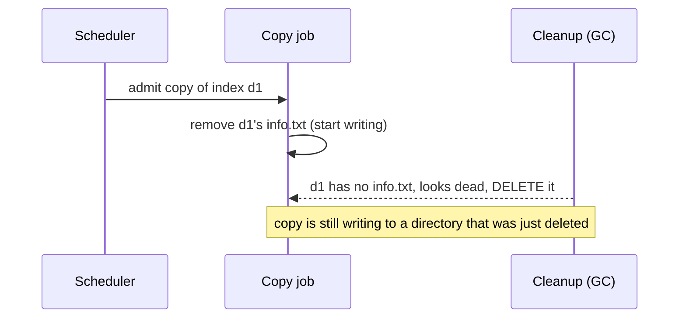

# Report template

Read at phase 9. The report leads with plain language everyone can read. The model and the math go
at the bottom as an optional appendix. Apply `07-writing-style.md` to every sentence before
returning it. When a shareable visual would help a non-developer, render the report as an artifact
with the trace diagram.

## Structure

```
# What could go wrong: <the worry in one plain line>

## The short answer
One or two sentences, and one of three verdicts. "Yes, this can happen today" with the one-line
trigger. "It cannot happen today, but only because <X holds>; it becomes a bug the moment <X> changes"
— a latent gap (see below). Or "No problem found at the size checked" with the honest caveat. No
jargon.

## What can happen, concretely
The counterexample as a short story a non-developer can follow. Name the actors in real terms (the
copy, the cleanup job), not model names. Walk the steps in order and end on the bad outcome and who
it hurts (a customer sees an empty index, a request fails and retries).

## How often / under what conditions
When the interleaving is possible in practice. Is it a narrow timing window, a specific operation
pairing, a particular configuration. Do not overstate frequency; state the conditions.

## Suggested fix
The change in plain terms, then the specific guard. Note that it was validated in the model (the
before/after from the self-validating step). Flag if the real code fix likely differs from the
model's exact guard, and why.

## Confidence and scope  (always include, verbatim intent)
- Proof rung (see SKILL.md, "the proof ladder"): mechanism shown / precondition reachable / repro.
  State it in one sentence and do not round up. A counterexample alone is rung 1: it says "if the
  system reaches this state, the bad thing follows," and the "if" is unproven. If no code-level
  artifact arms the precondition, the verdict is "narrowed to one predicate, arming not established" —
  name the cheapest instrument that would settle it rather than implying a root cause.
- At rung 3, name the control test and its outcome alongside the failing one ("the same steps without
  the rebalance pass either way"). That sentence is what tells a reader the red is attributable to the
  trigger rather than to the harness, and it is the first thing a reviewer asks for.
- What was checked: the property, and the size (e.g. 2 jobs, 2 dirs, 1 worker).
- Strength: "A concrete counterexample was found" is strong evidence of a real design flaw. "No
  counterexample at this size" is weak: it is not a proof about the running code. If the counterexample
  is a latent gap, say so here too: the flaw is real but currently masked, so its severity today is
  bounded by how likely the masking assumption is to change.
- The model-code gap: this checked a hand-written model of the design, not the compiled binary. The
  model's fidelity rests on the file:line anchors, which a developer can audit.
- Recommended next step at the implementation tier when relevant (a ThreadSanitizer run, a targeted
  test) so the fix stays fixed.

## Appendix (optional, for the curious)
Link the model files and note they are runnable (the recipe is in reference/03-tooling-setup.md).
Offer reference/06-math-appendix.md for anyone who wants to understand TLA+ and the checker. This is
an invitation, never required reading.
```

## Live bug vs latent gap

When the model reaches the bad state, decide which of two things you found, and say which in the short
answer. The reader acts very differently on each.

A **live bug** is reachable in the code as it runs today: the dangerous interleaving needs only inputs
and timing that production already produces. This is a "fix it" finding.

A **latent gap** is reachable in the abstract design but blocked today by an incidental fact the
checked property does not depend on. The classic shape: a conflict scan ignores a field, which is safe
only because every job that carries that field also happens to be non-parallelizable, so it conflicts
on other grounds. Nothing in the scan enforces that; a future job that breaks the coincidence opens
the hole. Model this by adding the masking fact as an explicit `await`, confirming the model goes
green, then removing it and confirming the violation returns. That before/after is the evidence that
the gap is real and that one assumption is all that stands between it and a live bug.

Do not upgrade a latent gap to a live bug for impact, or bury it as a non-issue. Report it as what it
is: safe now, one refactor away from broken. The fix is usually to make the guard enforce the fact it
currently assumes, or to assert the assumption in code so a future change fails loudly rather than
silently.

## Refuted worry

The third verdict: the model is green and the code is genuinely safe. Report it plainly as "no, this
cannot happen, because <the structural reason>" — name the lock that covers both sides, or the
ordering that keeps the resource protected. Two duties keep this honest. First, cite the mutation
proof: the companion hypothesis model that goes red, so the reader sees the green was not vacuous.
Second, pin the refutation to the exact anchors it depends on ("this holds only because `inUse++` and
the read-commit sit in the same locked section"), and say which refactor would reopen the hole — that
is the same "one change away" honesty a latent gap gets, pointed the other way. A refutation is a real
answer worth delivering, not a failed hunt; but keep it a bounded-model result, never a proof.

## The trace diagram

Render the counterexample as a small mermaid sequence so a non-developer can see the ordering. One
participant per actor, one arrow per step, the bad step marked. For a delete-in-flight finding:



Keep it to the states in the actual TLC trace, one arrow per real step, anchored to the same
file:line as the model. Do not invent steps for narrative polish.

## Tone reminders

- Lead with the answer, then the detail.
- Real-world nouns over model names in the body; model names only in the appendix.
- Never claim a proof. A found bug is a found bug; a clean run is "nothing found at size N".
- Keep the whole top half readable by someone who has never seen code. A developer can drop into the
  appendix; a PM should not have to.
